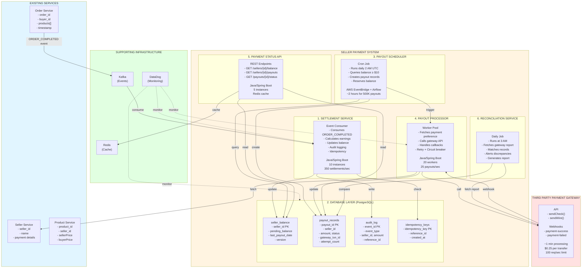

# Seller Payment System - High Level Architecture

## Flow Description

### Settlement Flow (Order → Balance)
1. **Order Service** publishes `ORDER_COMPLETED` event to Kafka
2. **Settlement Service** consumes event and:
   - Validates idempotency
   - Calculates seller earnings
   - Updates `seller_balance` with optimistic locking
   - Writes to `audit_log`

### Payout Flow (Balance → Bank)
1. **Payout Scheduler** (daily 2 AM):
   - Queries sellers with balance ≥ $10
   - Creates records in `payout_records`
   - Reserves balance
2. **Payout Processor**:
   - Fetches seller payment preference
   - Calls payment gateway API
   - Handles async callbacks
   - Updates payout status
3. **Reconciliation Service** (daily 3 AM):
   - Matches gateway reports with internal records
   - Alerts on discrepancies

## Key Characteristics
- **Throughput**: 350 settlements/sec, 25 payouts/sec
- **Scale**: 500K payouts in 2 hours
- **Database**: PostgreSQL Multi-AZ with 2 read replicas
- **Reliability**: Idempotency, optimistic locking, retry logic, circuit breaker
