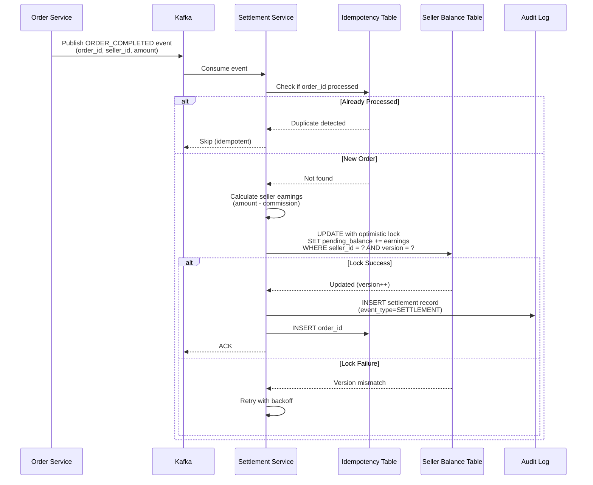
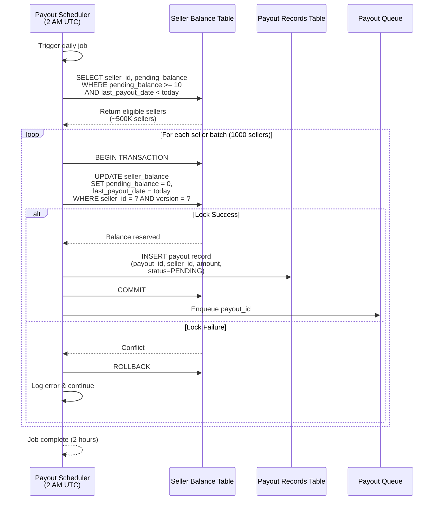
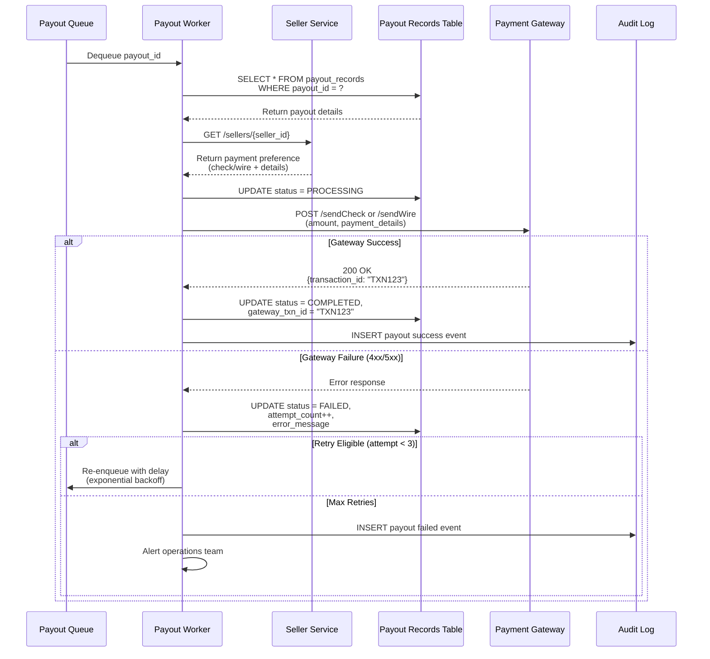
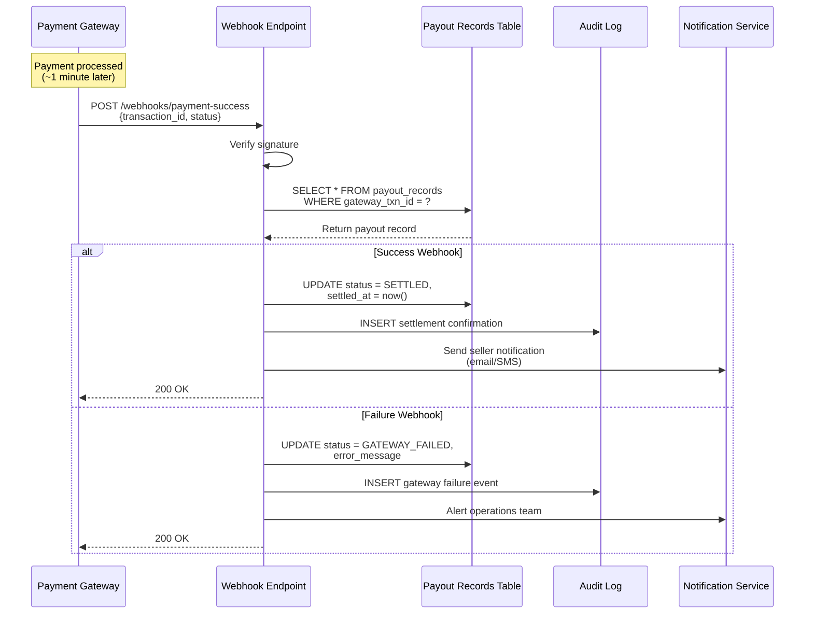
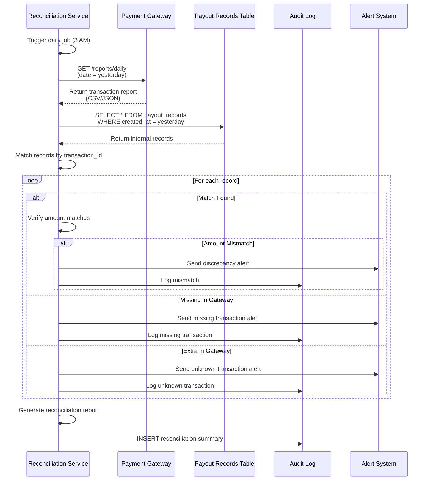
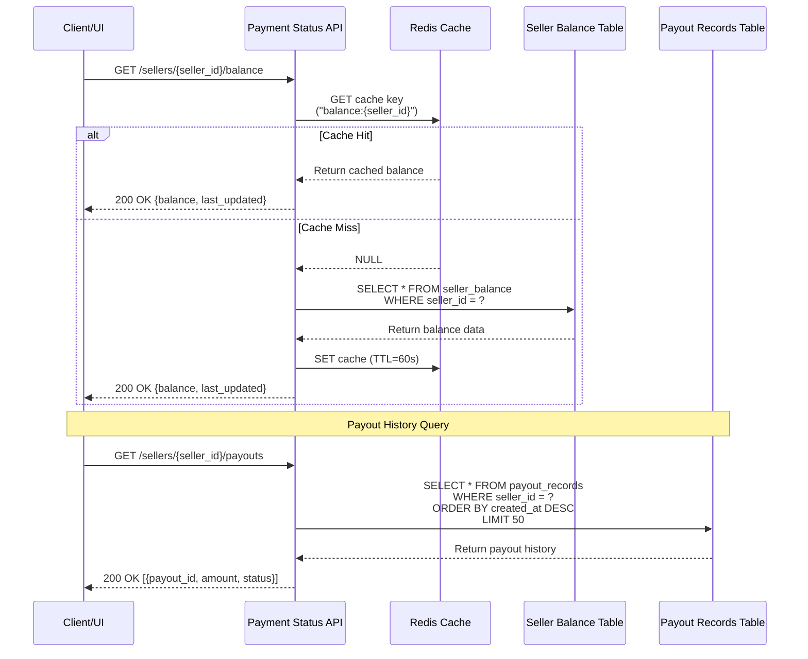
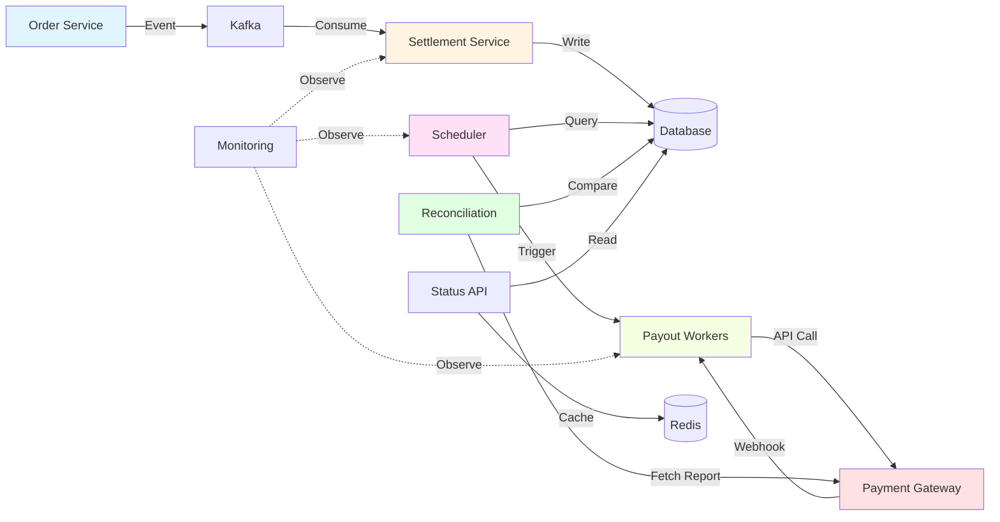

# Seller Payment System - HLD Flow Diagram

## Flow 1: Settlement Flow (Order Completion → Balance Update)

## Flow 2: Payout Initiation Flow (Daily Scheduler)

## Flow 3: Payout Processing Flow (Worker Pool)

## Flow 4: Gateway Webhook Callback Flow

## Flow 5: Reconciliation Flow (Daily 3 AM)

## Flow 6: Balance Query Flow (API)

## Component Interaction Summary

## Key Flow Characteristics

| Flow | Frequency | Throughput | Latency |
|------|-----------|------------|---------|
| Settlement | Real-time | 350/sec | <100ms |
| Payout Initiation | Daily 2 AM | 500K in 2h | N/A |
| Payout Processing | Continuous | 25/sec | ~1 min |
| Reconciliation | Daily 3 AM | 500K records | ~30 min |
| Balance Query | On-demand | Low | <50ms |
